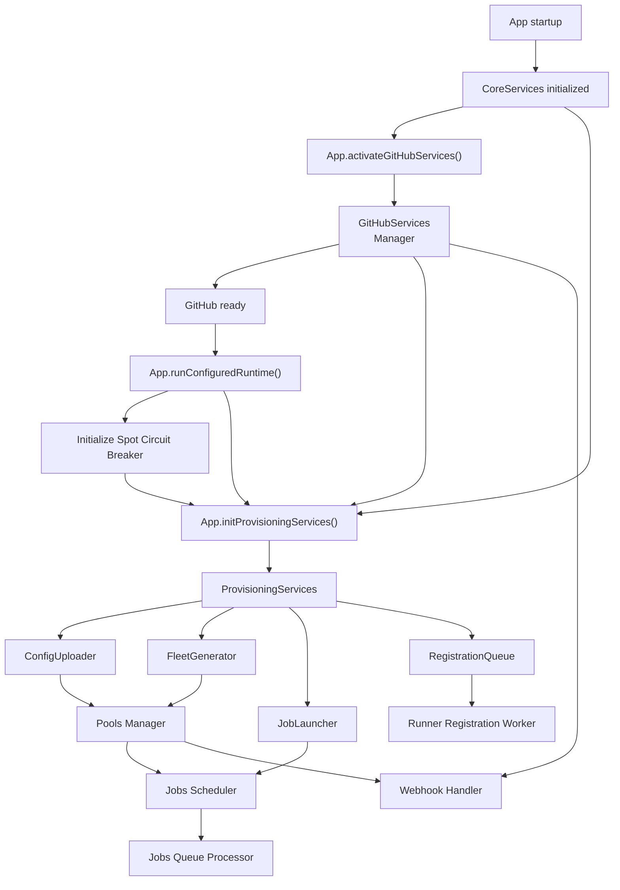

# Provisioning Services

This document describes how the server composes provisioning-related services after startup.

## Ownership Boundary

`pkg/server` is the composition root. It owns lifecycle, startup ordering, and adaptation from `Stack` plus `ProcessEnv` into runtime collaborators.

`pkg/server/provisioning` owns provisioning logic and typed constructor inputs such as:

- `InstanceConfigRuntime`
- `JobLauncherDeps`
- `LaunchContext`
- `LaunchTags`

The server groups long-lived dependencies into three service sets:

- `CoreServices`: shared services used across subsystems
- `GitHubServices`: the configured GitHub manager
- `ProvisioningServices`: provisioning-specific services used by pools and jobs

## Why Registration Lives In Provisioning

The registration queue lives under `ProvisioningServices` because it completes provisioning after instance launch. Launching emits a provisioning-owned `LaunchCompletion`, registration turns that into a provisioning-owned queue message, then the worker obtains JIT credentials and uploads the final runner config for that instance.

`GitHubServices` still matters here, but as a dependency rather than the owner of the workflow. The worker calls GitHub as one step in finishing provisioning for the launched runner, not as a generic GitHub service.

## Startup Flow

1. The app bootstraps `CoreServices`.
2. `App.activateGitHubServices()` creates the GitHub manager, refreshes it, and stores `GitHubServices`.
3. `runConfiguredRuntime()` waits until GitHub services are ready.
4. The app initializes the spot interruption tracker.
5. `App.initProvisioningServices()` constructs:
   - the instance config uploader
   - the fleet generator
   - the registration queue
   - the job launcher
6. The pools manager consumes `ProvisioningServices.ConfigUploader` and `ProvisioningServices.FleetGenerator`.
7. The jobs scheduler consumes `ProvisioningServices.JobLauncher`.
8. The registration worker runs from `ProvisioningServices.RegistrationQueue`.

## Diagram

